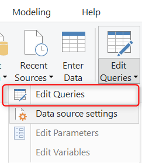
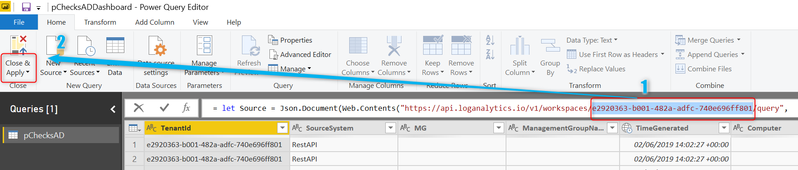
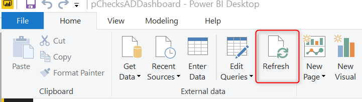
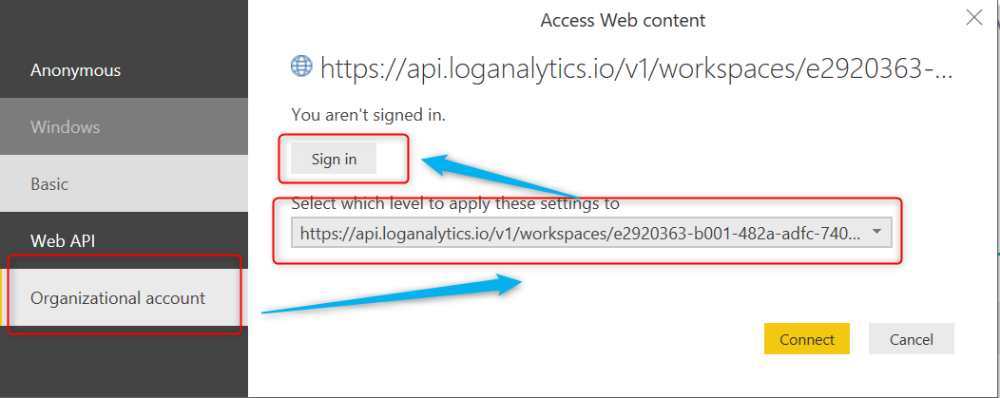

# How to connect PowerBI dashboard

To connect PowerBI Dashboard to your Log Analytics you need to replace workspace ID in the query.
To do that:
1. Open PowerBI file [pChecksADDashboard](..\pChecksAD\bin\DashBoard\pChecksADDashboard.pbix)
2. From the menu select `Edit Queries` and then `Edit Queries` again:

3. Replace current Workspace with your WorkspaceID and then click `Close & Apply`

4. From the menu select `Refresh`

5. Select your organizational account, current workspace scope and sign in

